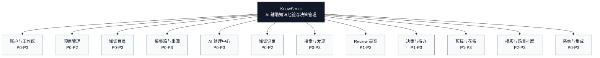
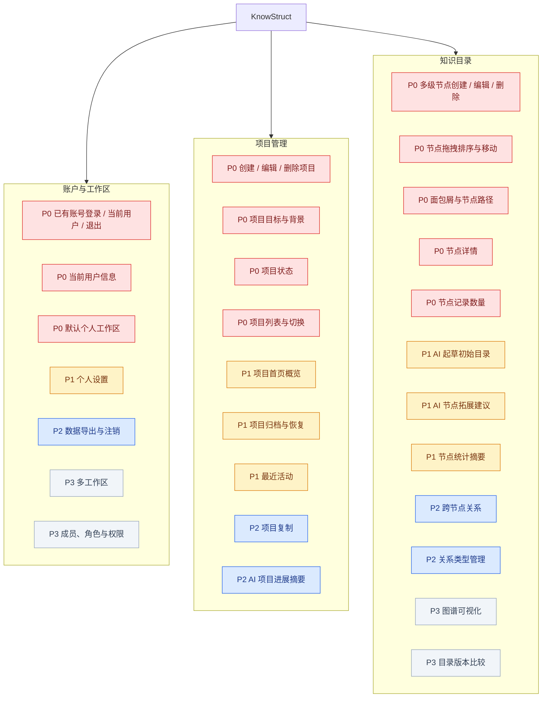
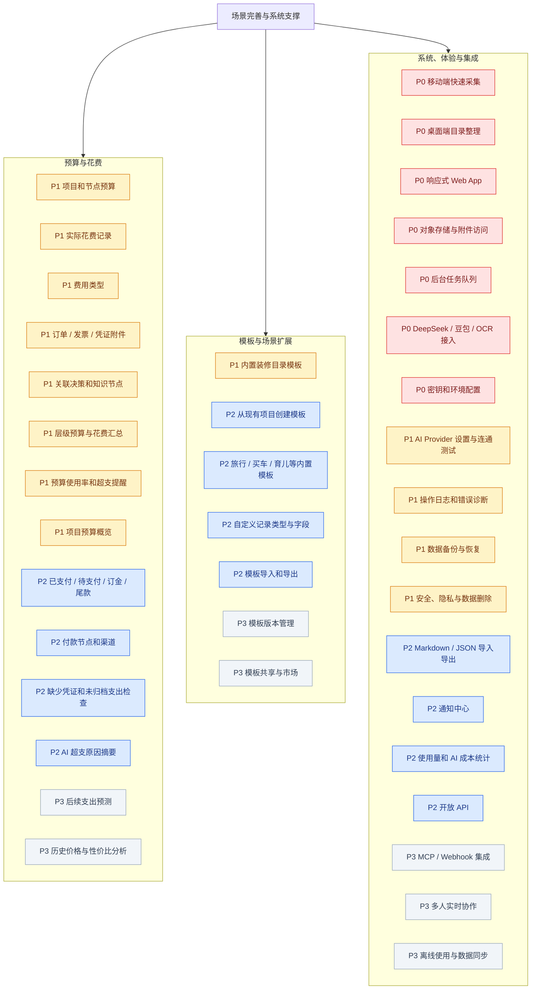
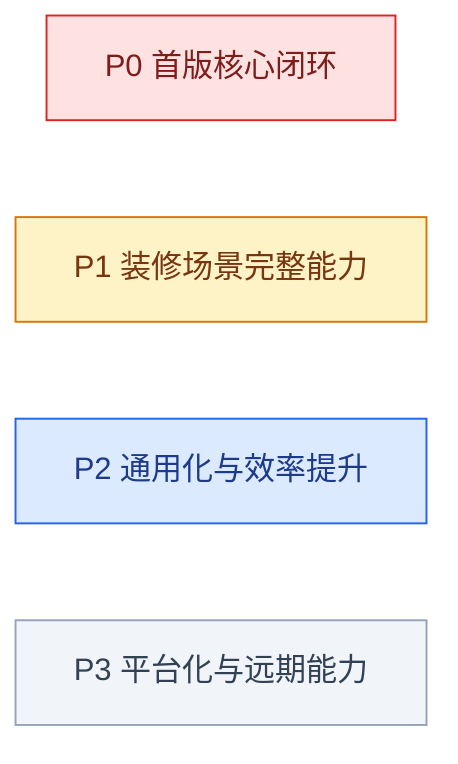

# KnowStruct 功能结构图与优先级

## 1. 文档目的

本文档用于提供 KnowStruct 的完整功能总览，并明确各功能的实施优先级。

产品核心链路：

```text
零散资料采集 -> AI 结构化提取 -> 人工确认 -> 知识目录归档
-> 搜索与持续补充 -> Review 审查 -> 决策与经验沉淀
```

优先级定义：

| 优先级 | 含义 | 判断标准 |
|---|---|---|
| P0 | 首版核心闭环 | 缺少该功能就无法验证产品核心价值 |
| P1 | 装修场景完整能力 | 核心闭环跑通后，应优先补齐的高价值功能 |
| P2 | 通用化与效率提升 | 有真实使用数据后再建设的增强能力 |
| P3 | 平台化与远期能力 | 多用户、多场景或规模化后再考虑 |

> 优先级表示建议实施顺序，不表示功能最终是否重要。

## 2. 产品功能总览



## 3. 核心业务闭环


## 4. 完整功能结构

### 4.1 账户、项目与知识目录



### 4.2 采集箱、AI 处理与知识记录

```mermaid
flowchart TB
    ROOT["资料进入正式知识库"]

    subgraph INBOX["采集箱与来源"]
        D1["P0 快速文字记录"]
        D2["P0 图片 / 截图上传"]
        D3["P0 网页链接粘贴"]
        D4["P0 原始文件与来源保存"]
        D5["P0 来源预览"]
        D6["P0 待处理 / 处理中 / 待确认状态"]
        D7["P0 失败提示与重新处理"]
        D8["P1 PDF 上传与解析"]
        D9["P1 网页正文和元数据抓取"]
        D10["P1 批量选择、移动和删除"]
        D11["P1 重复来源检测"]
        D12["P2 浏览器扩展"]
        D13["P2 手机分享入口"]
        D14["P3 视频 / 音频 / 聊天记录导入"]
    end

    subgraph AI["AI 处理中心"]
        E1["P0 OCR 文字识别"]
        E2["P0 文本清洗与分段"]
        E3["P0 经验 / 参数 / 避坑等类型提取"]
        E4["P0 适用条件提取"]
        E5["P0 原文证据定位"]
        E6["P0 置信度输出"]
        E7["P0 建议归档节点"]
        E8["P0 提取结果编辑 / 确认 / 拒绝"]
        E9["P0 原始内容与 AI 内容分离保存"]
        E10["P0 AI Provider 统一接口"]
        E11["P0 异步任务、进度与重试"]
        E12["P1 提示词和模型版本记录"]
        E13["P1 重新提取与结果比较"]
        E14["P1 批量确认"]
        E15["P2 按资料类型选择模型"]
        E16["P2 领域化提取 Schema"]
        E17["P3 本地模型与离线处理"]
    end

    subgraph ENTRY["知识记录"]
        F1["P0 创建 / 编辑 / 删除记录"]
        F2["P0 经验 / 参数 / 避坑 / 商品 / 价格等类型"]
        F3["P0 待确认 / 已归档 / 有冲突等状态"]
        F4["P0 记录归档到目录节点"]
        F5["P0 一条记录关联多个来源"]
        F6["P0 来源原文和附件追溯"]
        F7["P1 标签与结构化字段"]
        F8["P1 修改历史"]
        F9["P1 批量移动和修改状态"]
        F10["P1 商品 / 参数候选对比"]
        F11["P2 双向链接与语义关联"]
        F12["P2 重复记录合并"]
    end

    ROOT --> INBOX
    INBOX --> AI
    AI --> ENTRY

    classDef p0 fill:#fee2e2,color:#7f1d1d,stroke:#dc2626;
    classDef p1 fill:#fef3c7,color:#78350f,stroke:#d97706;
    classDef p2 fill:#dbeafe,color:#1e3a8a,stroke:#2563eb;
    classDef p3 fill:#f1f5f9,color:#334155,stroke:#94a3b8;
    class D1,D2,D3,D4,D5,D6,D7,E1,E2,E3,E4,E5,E6,E7,E8,E9,E10,E11,F1,F2,F3,F4,F5,F6 p0;
    class D8,D9,D10,D11,E12,E13,E14,F7,F8,F9,F10 p1;
    class D12,D13,E15,E16,F11,F12 p2;
    class D14,E17 p3;
```



### 4.3 搜索、Review 与决策

```mermaid
flowchart TB
    ROOT["知识使用与决策"]

    subgraph SEARCH["搜索与发现"]
        G1["P0 按标题和内容搜索"]
        G2["P0 按来源内容搜索"]
        G3["P0 搜索结果跳转与来源追溯"]
        G4["P1 按项目 / 节点 / 类型 / 状态筛选"]
        G5["P1 关键词高亮"]
        G6["P1 最近查看与最近搜索"]
        G7["P2 语义搜索"]
        G8["P2 相似记录推荐"]
        G9["P2 基于知识库问答并附引用"]
        G10["P3 保存搜索与订阅提醒"]
    end

    subgraph REVIEW["Review 审查"]
        H1["P1 缺少来源检查"]
        H2["P1 缺少适用条件检查"]
        H3["P1 重复记录识别"]
        H4["P1 疑似冲突识别与原因解释"]
        H5["P1 长期待确认事项"]
        H6["P1 问题详情与关联证据"]
        H7["P1 接受 / 拒绝 / 解决问题"]
        H8["P1 Review 修改建议"]
        H9["P2 信息过期检查"]
        H10["P2 高风险节点检查"]
        H11["P2 决策依据充分性检查"]
        H12["P2 定时 Review"]
        H13["P3 持续自动审查"]
    end

    subgraph DECISION["决策与待办"]
        I1["P1 创建最终决策"]
        I2["P1 候选方案记录"]
        I3["P1 选择理由与约束条件"]
        I4["P1 关联知识记录和原始来源"]
        I5["P1 最终型号 / 渠道 / 价格"]
        I6["P1 决策变更历史"]
        I7["P2 候选项比较矩阵"]
        I8["P2 节点检查清单"]
        I9["P2 待办、截止时间与完成状态"]
        I10["P2 决策复盘"]
        I11["P3 跨项目决策模式沉淀"]
    end

    ROOT --> SEARCH
    SEARCH --> REVIEW
    REVIEW --> DECISION

    classDef p0 fill:#fee2e2,color:#7f1d1d,stroke:#dc2626;
    classDef p1 fill:#fef3c7,color:#78350f,stroke:#d97706;
    classDef p2 fill:#dbeafe,color:#1e3a8a,stroke:#2563eb;
    classDef p3 fill:#f1f5f9,color:#334155,stroke:#94a3b8;
    class G1,G2,G3 p0;
    class G4,G5,G6,H1,H2,H3,H4,H5,H6,H7,H8,I1,I2,I3,I4,I5,I6 p1;
    class G7,G8,G9,H9,H10,H11,H12,I7,I8,I9,I10 p2;
    class G10,H13,I11 p3;
```



### 4.4 预算、模板与系统能力



## 5. 各阶段建议边界

### P0：首个可用闭环

目标：用真实装修资料验证“采集、提取、确认、归档、检索、溯源”是否有价值。

```text
账户与默认工作区
项目管理
多级知识目录
文字 / 截图 / 链接采集
原始来源和附件保存
OCR 与结构化信息提取
证据、条件、置信度和建议节点
人工编辑、确认和拒绝
正式知识记录及来源追溯
基础关键词搜索
移动端采集与桌面端整理
AI Provider 抽象、异步任务和失败重试
```

验收重点：

- 使用至少 50 至 100 份真实装修截图、链接和记录测试。
- 用户可以在较短时间内完成一份资料的确认和归档。
- 所有正式知识记录都可以追溯到原始来源。
- AI 输出错误时不会污染正式知识库。
- 一周后仍能通过目录或搜索找到并使用已整理信息。

### P1：装修场景完整版本

目标：让整理后的知识真正参与装修选择、风险检查和预算控制。

```text
AI 起草目录与节点拓展
PDF 和网页正文解析
批量整理与重复来源检测
结构化字段、历史版本和候选对比
组合筛选和全文搜索体验
重复、冲突、缺少条件和缺少来源 Review
最终决策、理由、证据和变更记录
节点预算、实际花费、凭证、层级汇总和超支提醒
装修模板、项目概览、备份和基础安全能力
```

### P2：通用化与效率提升

目标：在装修场景验证成功后，降低多项目、多领域的整理成本。

```text
语义搜索、相似推荐和带引用问答
跨节点关系与语义关联
定时 Review 和高级风险检查
待办、检查清单、候选比较和决策复盘
付款过程、AI 预算分析和费用 Review
多场景模板与自定义 Schema
浏览器扩展、手机分享、导入导出和开放 API
```

### P3：平台化能力

目标：用户量、协作需求和使用规模达到一定程度后再建设。

```text
多工作区、团队角色和权限
知识图谱可视化
视频、音频和聊天记录处理
本地模型与离线同步
持续自动 Review
跨项目知识和决策模式沉淀
智能支出预测与价格分析
模板市场、MCP、Webhook 和实时协作
```

## 6. 产品范围约束

为避免第一版变成多个成熟产品的简单叠加，建议坚持以下约束：

1. 第一阶段将 `nodes` 定义为知识目录树，不引入图数据库。
2. 第一阶段不以 AI 聊天为主入口，优先做好结构化提取和人工确认。
3. 原始来源、AI 提取结果、正式知识记录、最终决策必须分层保存。
4. AI Review 只生成问题和建议，不直接修改正式记录。
5. 预算第一阶段只服务装修决策，不扩展成完整财务记账系统。
6. 手机端优先降低采集成本，桌面端优先提高整理和 Review 效率。
7. 新增高级功能前，先用真实资料验证上一阶段的使用频率和价值。

## 7. 优先级颜色图例


